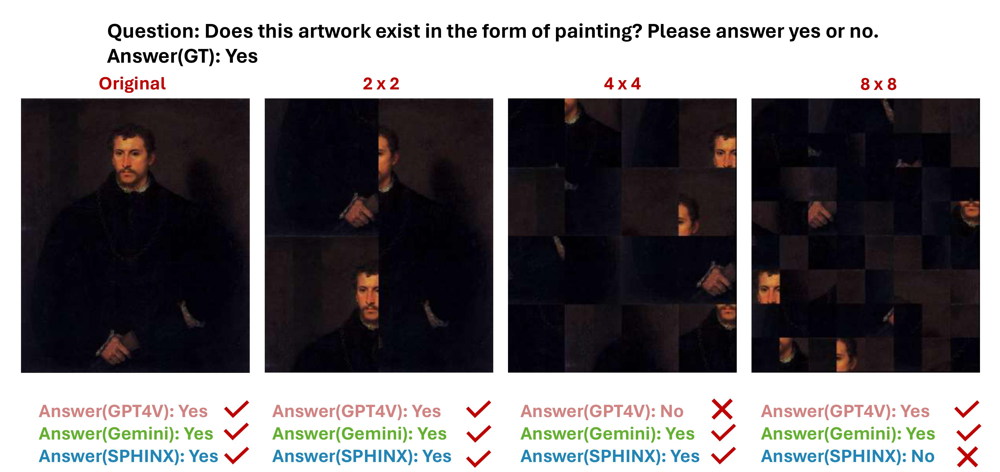
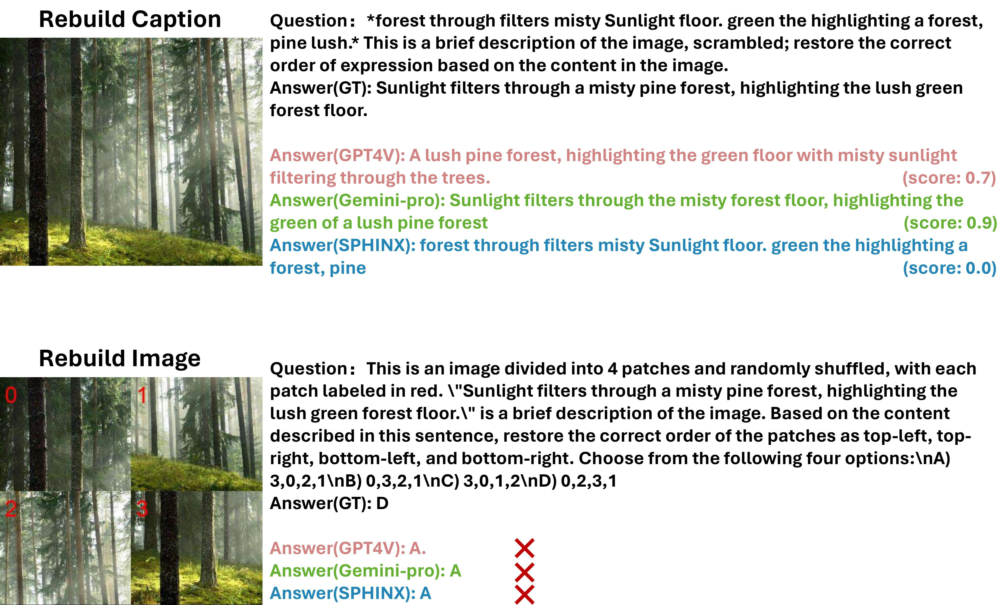
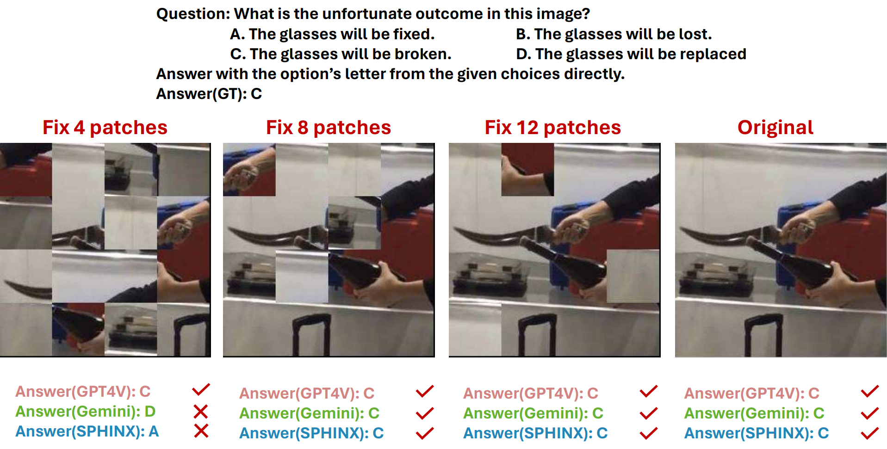

# MMS-e: Benchmarking the Resilience of Large Multimodal Models to Visual Scrambling
## Benchmark Examples

Patchwise Question Answering: Divide the images into 2x2, 4x4, and 8x8 patches, then shuffle all the patches, and measure the ability of LMMs to answer questions about these images. 

Reconstruction task: Let LMMs reconstruct the order of shuffled patches based on the image' s caption, and let LMMs reconstruct the shuffled caption based on the image. 

Fixed Patch Question Answering: Divide the image into 4x4 patches, randomly fix some of the patches, and let LMMs answer questions based on the image.

## Directory Structure
- dataset/:
  - You can use the files here to process the raw image data.
- scripts/:
  - Contains the scripts to run the baseline and evaluate the results.
- original/:
  - The annotations files corresponding to the original images.
- Patchwise QA/:
  - The annotations files about Patchwise Question Answering.
- Reconstruction/:
  - The annotations files about Reconstruction task.
- Fixed Patch QA/:
  - The annotations files about Fixed Patch Question Answering.

 ## Evaluate on our Benchmark
- **Install**  
Download our benchmark image from our [Releases](https://huggingface.co/datasets/jyjyjyjy/MMS-e)
```Shell
git clone git@github.com:wanshiruyishoubinanshan/MMS-e.git
cd MMS-e
mkdir evaluate_results
```

- **Prepare your model output**  
Prepare your results in the following format, Key "prompt" is the input of the model, you better use the Jsonl file to store your results.

```json
{
  "question_id": 110, 
  "prompt": "Is there any defect in the object in this image? Answer the question using a single word or phrase.", 
  "model_output": "Yes",
}
```
- **Rename your Jsonl file**  
Rename your Jsonl file to ```xxxx_TaskName.jsonl``` like the following project tree. You must keep the style of the suffix consistent with the example.
```
.
├── xxxxxxxx_action_recognition.jsonl
├── xxxxxxxx_artwork_recognition.jsonl
├── xxxxxxxx_celebrity_recognition.jsonl
├── xxxxxxxx_commonsese_reasoning.jsonl
├── xxxxxxxx_future_prediction.jsonl
├── xxxxxxxx_image_scene.jsonl
├── xxxxxxxx_image_topic.jsonl
├── xxxxxxxx_instances_attributes.jsonl
├── xxxxxxxx_instances_counting.jsonl
├── xxxxxxxx_object_localizatioin.jsonl
├── xxxxxxxx_text_recognition.jsonl
├── xxxxxxxx_visual_reasoning.jsonl
```

- **Evaluate your model output**  
Modify the file path and run the script [scripts/evaluate.sh](scripts/evaluate.sh)
```
bash scripts/evaluate.sh
```
Note: Score will be saved in the file [evaluate_results](evaluate_results/). 
